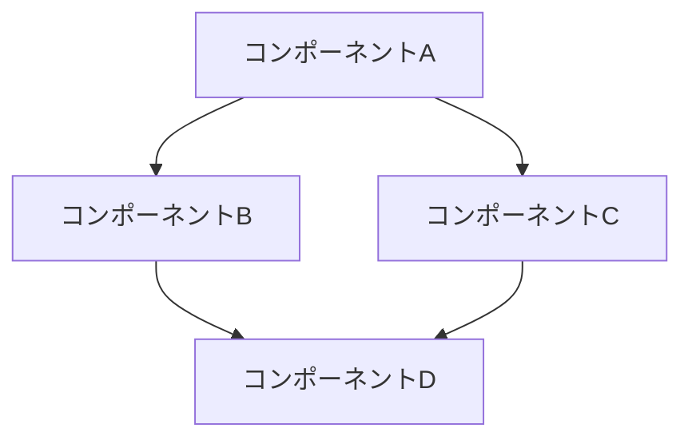
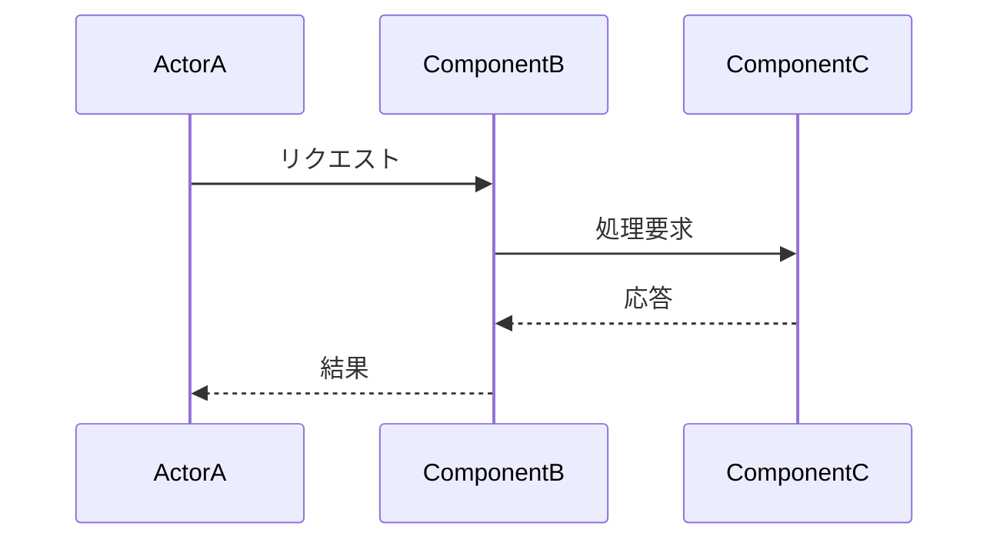

# [プロジェクト名] 全体アーキテクチャ設計

## 1. 概要
- システムの目的
- 主要な機能と責任範囲
- ステークホルダーと要件

## 2. アーキテクチャ原則
- 設計の指針となる原則
- 非機能要件（パフォーマンス、スケーラビリティ、セキュリティなど）

## 3. システム構造

## 4. コンポーネント概要
- 各コンポーネントの役割と責任
- コンポーネント間の関係

## 5. データフロー

## 6. 技術スタック
- フロントエンド技術
- バックエンド技術
- データベース
- インフラストラクチャ

## 7. クロスカッティング・コンサーン
- セキュリティ
- ロギング
- モニタリング
- エラーハンドリング

## 8. 将来の拡張性と進化
- 想定される変更点
- 拡張の方向性

## 9. オープンイシューと決定事項
- 未解決の問題
- 検討中の選択肢
- アーキテクチャ上の意思決定

## 変更履歴
| 日付 | バージョン | 担当者 | 変更内容 |
|------|------------|--------|----------|
| YYYY-MM-DD | 0.1 | 名前 | 初稿作成 |