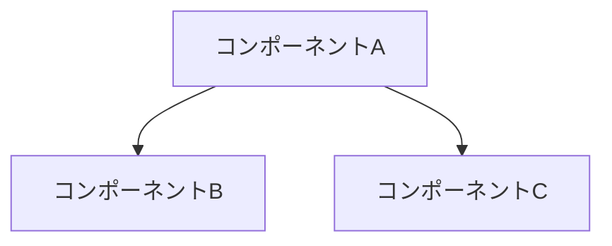

# [機能名] 設計仕様書

## 1. 概要
- 機能の目的
- ユースケース
- 主要なステークホルダー

## 2. 要件
- 機能要件
- 非機能要件（パフォーマンス、UX、アクセシビリティなど）

## 3. 設計
### 3.1 コンポーネント構造


### 3.2 シーケンス図
```mermaid
sequenceDiagram
    Actor->>Component: アクション
    Component->>Service: 処理要求
    Service->>Database: クエリ
    Database-->>Service: 結果
    Service-->>Component: 応答
    Component-->>Actor: 表示
```

## 4. データモデル
- エンティティ
- 属性とリレーション
- 検証ルール

## 5. API設計
### 5.1 エンドポイント
| エンドポイント | メソッド | 説明 | リクエスト | レスポンス |
|--------------|---------|------|-----------|-----------|
| `/api/resource` | GET | リソース取得 | クエリパラメータ | JSONオブジェクト |

### 5.2 エラーハンドリング
- エラーコード
- エラーメッセージ

## 6. UI/UX設計
- ワイヤーフレーム
- インタラクションフロー
- UIコンポーネント

## 7. セキュリティ考慮事項
- 認証/認可
- データ保護
- 入力バリデーション

## 8. テスト戦略
- ユニットテスト
- 統合テスト
- E2Eテスト

## 9. オープンイシュー
- 未解決の技術的課題
- 要検討事項

## 変更履歴
| 日付 | バージョン | 担当者 | 変更内容 |
|------|------------|--------|----------|
| YYYY-MM-DD | 0.1 | 名前 | 初稿作成 |